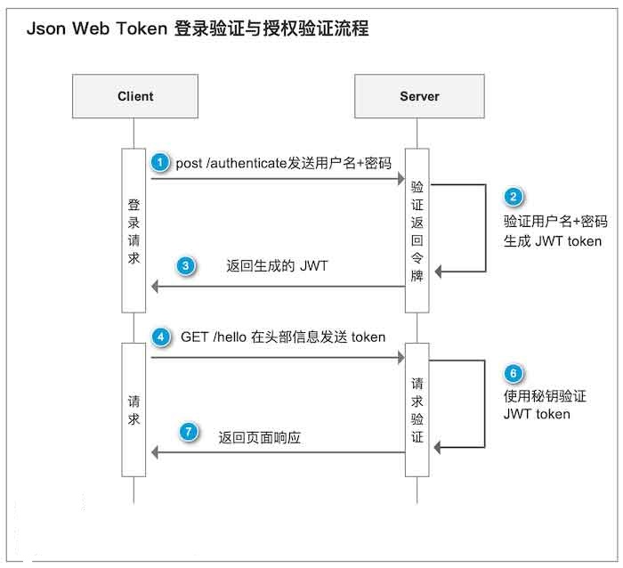
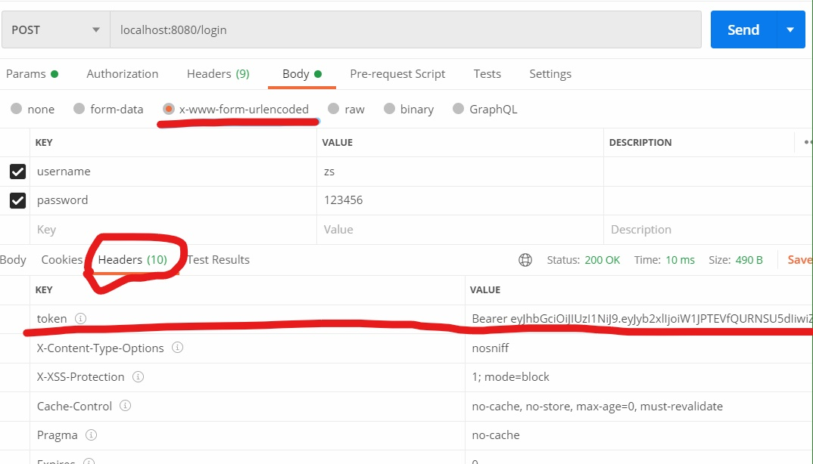
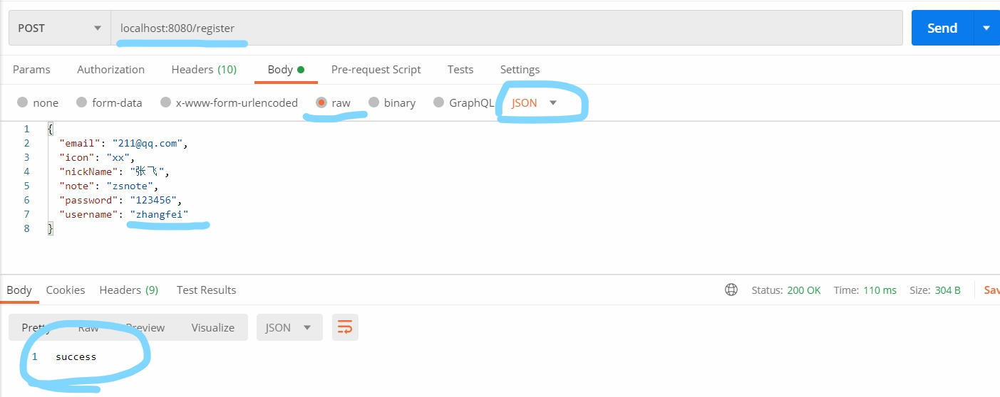

# 项目说明  
##  JWT的工作流程
下面是一个JWT的工作流程图。模拟一下实际的流程是这样的（假设受保护的API在/protected中）  



1、用户导航到登录页，输入用户名、密码，进行登录  
2、服务器验证登录鉴权，如果改用户合法，根据用户的信息和服务器的规则生成JWT Token  
3、服务器将该token以json形式返回（不一定要json形式，这里说的是一种常见的做法）  
4、用户得到token，存在localStorage、cookie或其它数据存储形式中。  
5、以后用户请求/protected中的API时，在请求的header中加入 Authorization: Bearer xxxx(token)。此处注意token之前有一个7字符长度的 Bearer  
6、服务器端对此token进行检验，如果合法就解析其中内容，根据其拥有的权限和自己的业务逻辑给出对应的响应结果。  
7、用户取得结果  


## 整合步骤
1、添加Maven依赖  

```
<!--SpringSecurity依赖配置 -->
<dependency>
	<groupId>org.springframework.boot</groupId>
	<artifactId>spring-boot-starter-security</artifactId>
</dependency>
			
<!--JWT(Json Web Token)登录支持 -->
<dependency>
	<groupId>io.jsonwebtoken</groupId>
	<artifactId>jjwt</artifactId>
	<version>0.9.0</version>
</dependency>
```

2、新建Token加解密工具类  

``` 
import java.util.Date;
import java.util.HashMap;
import java.util.Map;

import org.springframework.beans.factory.annotation.Value;
import org.springframework.security.core.userdetails.UserDetails;
import org.springframework.stereotype.Component;

import io.jsonwebtoken.Claims;
import io.jsonwebtoken.Jwts;
import io.jsonwebtoken.SignatureAlgorithm;
import lombok.extern.slf4j.Slf4j;

@Slf4j
public class JwtTokenUtil
{
	// Token请求头
	public static final String TOKEN_HEADER = "Authorization";
	// Token前缀
	public static final String TOKEN_PREFIX = "Bearer ";

	// 签名主题
	public static final String SUBJECT = "mySecret";
	// 过期时间
	public static final long EXPIRITION = 1000 * 24 * 60 * 60 * 7;
	// 应用密钥
	public static final String APPSECRET_KEY = "piconjo_secret";
	// 角色权限声明
	private static final String ROLE_CLAIMS = "role";

	/**
	 * 生成Token
	 */
	public static String createToken(String username, String role)
	{
		Map<String, Object> map = new HashMap<>();
		map.put(ROLE_CLAIMS, role);

		String token = Jwts.builder()
				.setSubject(username)
				.setClaims(map)
				.claim("username", username)
				.setIssuedAt(new Date())
				.setExpiration(new Date(System.currentTimeMillis() + EXPIRITION))
				.signWith(SignatureAlgorithm.HS256, APPSECRET_KEY)
				.compact();
		return token;
	}

	/**
	 * 校验Token
	 */
	public static Claims checkJWT(String token)
	{
		try
		{
			final Claims claims = Jwts.parser()
					.setSigningKey(APPSECRET_KEY)
					.parseClaimsJws(token)
					.getBody();
			return claims;
		}
		catch (Exception e)
		{
			e.printStackTrace();
			return null;
		}
	}

	/**
	 * 从Token中获取username
	 */
	public static String getUsername(String token)
	{
		Claims claims = Jwts.parser()
				.setSigningKey(APPSECRET_KEY)
				.parseClaimsJws(token)
				.getBody();
		return claims.get("username")
				.toString();
	}

	/**
	 * 从Token中获取用户角色
	 */
	public static String getUserRole(String token)
	{
		Claims claims = Jwts.parser()
				.setSigningKey(APPSECRET_KEY)
				.parseClaimsJws(token)
				.getBody();
		return claims.get("role")
				.toString();
	}

	/**
	 * 校验Token是否过期
	 */
	public static boolean isExpiration(String token)
	{
		Claims claims = Jwts.parser()
				.setSigningKey(APPSECRET_KEY)
				.parseClaimsJws(token)
				.getBody();
		return claims.getExpiration()
				.before(new Date());
	}
}
```

3、新增自定义UserDetailsService实现类，用于加载用户信息    
JWT只不过提供了一种基于token的请求验证机制。但是请求验证后，还需要校验用户是否有权限看对应的内容；  
为方便测试，需要建立两张表：用户表和角色表，见src/main/resources/sql/tableSchema.sql；  
然后建立两个实体类，User和Role，用于在security中进行接口访问的角色校验；这里为了方便，省略了用户角色的中间表；  

```

import java.util.ArrayList;
import java.util.List;

import org.springframework.beans.factory.annotation.Autowired;
import org.springframework.security.core.authority.SimpleGrantedAuthority;
import org.springframework.security.core.userdetails.UserDetails;
import org.springframework.security.core.userdetails.UserDetailsService;
import org.springframework.security.core.userdetails.UsernameNotFoundException;
import org.springframework.stereotype.Service;

import com.ctgu.mapper.RoleMapper;
import com.ctgu.mapper.UserMapper;
import com.ctgu.model.Role;
import com.ctgu.model.User;

@Service
public class JwtUserDetailsServiceImpl implements UserDetailsService
{
	@Autowired
	private UserMapper userMapper;
	@Autowired
	private RoleMapper roleMapper;

	@Override
	public UserDetails loadUserByUsername(String username) throws UsernameNotFoundException
	{
		if (username == null || "".equals(username))
		{
			throw new RuntimeException("用户不能为空");
		}
		// 调用方法查询用户
		User user = userMapper.findByUsername(username);
		if (user == null)
		{
			throw new RuntimeException("用户不存在");
		}
		List<SimpleGrantedAuthority> authorities = new ArrayList<>();
		for (Role role : roleMapper.findRoleByUsername(username))
		{
			authorities.add(new SimpleGrantedAuthority("ROLE_" + role.getName()));
		}
		return new org.springframework.security.core.userdetails.User(user.getUsername(), "{noop}" + user.getPassword(),
				authorities);
	}
}

```


4、配置登录拦截器和鉴权拦截器  

登录拦截器配置

``` 
import java.io.IOException;
import java.util.Collection;

import javax.servlet.FilterChain;
import javax.servlet.ServletException;
import javax.servlet.http.HttpServletRequest;
import javax.servlet.http.HttpServletResponse;

import org.springframework.security.authentication.AccountExpiredException;
import org.springframework.security.authentication.AuthenticationManager;
import org.springframework.security.authentication.BadCredentialsException;
import org.springframework.security.authentication.CredentialsExpiredException;
import org.springframework.security.authentication.DisabledException;
import org.springframework.security.authentication.InternalAuthenticationServiceException;
import org.springframework.security.authentication.LockedException;
import org.springframework.security.authentication.UsernamePasswordAuthenticationToken;
import org.springframework.security.core.Authentication;
import org.springframework.security.core.AuthenticationException;
import org.springframework.security.core.GrantedAuthority;
import org.springframework.security.core.userdetails.User;
import org.springframework.security.web.authentication.UsernamePasswordAuthenticationFilter;

import com.alibaba.fastjson.JSON;
import com.ctgu.util.JwtTokenUtil;

public class JwtLoginFilter extends UsernamePasswordAuthenticationFilter
{
	private AuthenticationManager authenticationManager;

	public JwtLoginFilter(AuthenticationManager authenticationManager)
	{
		this.authenticationManager = authenticationManager;
	}

	/**
	 * 验证操作 接收并解析用户凭证
	 */
	@Override
	public Authentication attemptAuthentication(HttpServletRequest request, HttpServletResponse response)
			throws AuthenticationException
	{
		// 从输入流中获取到登录的信息
		// 创建一个token并调用authenticationManager.authenticate() 让Spring security进行验证
		return authenticationManager.authenticate(new UsernamePasswordAuthenticationToken(
				request.getParameter("username"), request.getParameter("password")));
	}

	/**
	 * 验证【成功】后调用的方法 * 若验证成功 生成token并返回
	 */
	@Override
	protected void successfulAuthentication(HttpServletRequest request, HttpServletResponse response, FilterChain chain,
			Authentication authResult) throws IOException
	{
		User user = (User) authResult.getPrincipal();
		// 从User中获取权限信息
		Collection<? extends GrantedAuthority> authorities = user.getAuthorities();
		// 创建Token
		String token = JwtTokenUtil.createToken(user.getUsername(), authorities.toString());
		// 设置编码 防止乱码问题
		response.setCharacterEncoding("UTF-8");
		response.setContentType("application/json; charset=utf-8");
		// 在请求头里返回创建成功的token
		// 设置请求头为带有"Bearer "前缀的token字符串
		response.setHeader("token", JwtTokenUtil.TOKEN_PREFIX + token);
		// 处理编码方式 防止中文乱码
		response.setContentType("text/json;charset=utf-8");
		// 将反馈塞到HttpServletResponse中返回给前台
		response.getWriter()
				.write(JSON.toJSONString("登录成功"));
	}

	/**
	 * * 验证【失败】调用的方法
	 */
	@Override
	protected void unsuccessfulAuthentication(HttpServletRequest request, HttpServletResponse response,
			AuthenticationException failed) throws IOException, ServletException
	{
		String returnData = "";
		// 账号过期
		if (failed instanceof AccountExpiredException)
		{
			returnData = "账号过期";
		}
		// 密码错误
		else if (failed instanceof BadCredentialsException)
		{
			returnData = "密码错误";
		}
		// 密码过期
		else if (failed instanceof CredentialsExpiredException)
		{
			returnData = "密码过期";
		}
		// 账号不可用
		else if (failed instanceof DisabledException)
		{
			returnData = "账号不可用";
		}
		// 账号锁定
		else if (failed instanceof LockedException)
		{
			returnData = "账号锁定";
		}
		// 用户不存在
		else if (failed instanceof InternalAuthenticationServiceException)
		{
			returnData = "用户不存在";
		}
		// 其他错误
		else
		{
			returnData = "未知异常";
		}
		// 处理编码方式 防止中文乱码
		response.setContentType("text/json;charset=utf-8");
		// 将反馈塞到HttpServletResponse中返回给前台
		response.getWriter()
				.write(JSON.toJSONString(returnData));
	}
}
```


鉴权拦截器配置

``` 
import org.apache.commons.lang3.StringUtils;
import org.springframework.security.authentication.AuthenticationManager;
import org.springframework.security.authentication.UsernamePasswordAuthenticationToken;
import org.springframework.security.core.authority.SimpleGrantedAuthority;
import org.springframework.security.core.context.SecurityContextHolder;
import org.springframework.security.web.authentication.www.BasicAuthenticationFilter;

import com.ctgu.util.JwtTokenUtil;

import javax.servlet.FilterChain;
import javax.servlet.ServletException;
import javax.servlet.http.HttpServletRequest;
import javax.servlet.http.HttpServletResponse;
import java.io.IOException;
import java.util.ArrayList;
import java.util.Collection;

public class JwtAuthorizationFilter extends BasicAuthenticationFilter
{
	public JwtAuthorizationFilter(AuthenticationManager authenticationManager)
	{
		super(authenticationManager);
	}

	/**
	 * * 在过滤之前和之后执行的事件
	 */
	@Override
	protected void doFilterInternal(HttpServletRequest request, HttpServletResponse response, FilterChain chain)
			throws IOException, ServletException
	{
		String tokenHeader = request.getHeader(JwtTokenUtil.TOKEN_HEADER);
		// 若请求头中没有Authorization信息 或是Authorization不以Bearer开头 则直接放行
		if (tokenHeader == null || !tokenHeader.startsWith(JwtTokenUtil.TOKEN_PREFIX))
		{
			chain.doFilter(request, response);
			return;
		}
		// 若请求头中有token 则调用下面的方法进行解析 并设置认证信息
		SecurityContextHolder.getContext()
				.setAuthentication(getAuthentication(tokenHeader));
		super.doFilterInternal(request, response, chain);
	}

	/**
	 * 从token中获取用户信息并新建一个token
	 * 
	 * @param tokenHeader
	 *            字符串形式的Token请求头
	 * @return 带用户名和密码以及权限的Authentication
	 */
	private UsernamePasswordAuthenticationToken getAuthentication(String tokenHeader)
	{
		// 去掉前缀 获取Token字符串
		String token = tokenHeader.replace(JwtTokenUtil.TOKEN_PREFIX, "");
		// 从Token中解密获取用户名
		String username = JwtTokenUtil.getUsername(token);
		// 从Token中解密获取用户角色
		String role = JwtTokenUtil.getUserRole(token);
		// 将[ROLE_XXX,ROLE_YYY]格式的角色字符串转换为数组
		String[] roles = StringUtils.strip(role, "[]")
				.split(", ");
		Collection<SimpleGrantedAuthority> authorities = new ArrayList<>();
		for (String s : roles)
		{
			authorities.add(new SimpleGrantedAuthority(s));
		}
		if (username != null)
		{
			return new UsernamePasswordAuthenticationToken(username, null, authorities);
		}
		return null;
	}
}

```

5、配置匿名用户访问资源无权限处理器  

```
import java.io.IOException;

import javax.servlet.ServletException;
import javax.servlet.http.HttpServletRequest;
import javax.servlet.http.HttpServletResponse;

import org.springframework.security.core.AuthenticationException;
import org.springframework.security.web.AuthenticationEntryPoint;
import org.springframework.stereotype.Component;

import com.ctgu.common.api.CommonResult;

import cn.hutool.json.JSONUtil;

@Component
public class JwtAuthenticationEntryPoint implements AuthenticationEntryPoint
{
	@Override
	public void commence(HttpServletRequest request, HttpServletResponse response,
			AuthenticationException authException) throws IOException, ServletException
	{
		response.setCharacterEncoding("UTF-8");
		response.setContentType("application/json");
		response.getWriter()
				.println(JSONUtil.parse(CommonResult.unauthorized(authException.getMessage())));
		response.getWriter()
				.flush();
	}
}
```

6、新增SpringSecurity的自定义配置类  

```
import org.springframework.beans.factory.annotation.Autowired;
import org.springframework.context.annotation.Bean;
import org.springframework.context.annotation.Configuration;
import org.springframework.http.HttpMethod;
import org.springframework.security.config.annotation.authentication.builders.AuthenticationManagerBuilder;
import org.springframework.security.config.annotation.method.configuration.EnableGlobalMethodSecurity;
import org.springframework.security.config.annotation.web.builders.HttpSecurity;
import org.springframework.security.config.annotation.web.configuration.EnableWebSecurity;
import org.springframework.security.config.annotation.web.configuration.WebSecurityConfigurerAdapter;
import org.springframework.security.config.http.SessionCreationPolicy;
import org.springframework.security.core.userdetails.UserDetailsService;
import org.springframework.security.crypto.bcrypt.BCryptPasswordEncoder;
import org.springframework.security.crypto.password.PasswordEncoder;
import org.springframework.web.cors.CorsConfiguration;
import org.springframework.web.cors.CorsConfigurationSource;
import org.springframework.web.cors.UrlBasedCorsConfigurationSource;

import com.ctgu.common.auth.JwtAuthenticationEntryPoint;
import com.ctgu.common.auth.JwtAuthorizationFilter;
import com.ctgu.common.auth.JwtLoginFilter;

/**
 * @ClassName: SecurityConfig
 * @Description: Spring Security的配置
 * @author lh2
 * @date 2020年7月2日 上午9:44:48
 */
@Configuration
@EnableWebSecurity
@EnableGlobalMethodSecurity(prePostEnabled = true)
public class SecurityConfig extends WebSecurityConfigurerAdapter
{
	@Autowired
	private JwtAuthenticationEntryPoint restAuthenticationEntryPoint;

	@Autowired
	private UserDetailsService userDetailsService;

	@Override
	protected void configure(AuthenticationManagerBuilder auth) throws Exception
	{
		auth.userDetailsService(userDetailsService);
	}

	/**
	 * 安全配置
	 */
	@Override
	protected void configure(HttpSecurity http) throws Exception
	{
		http.cors() // 跨域共享
				.and()
				.csrf()
				.disable() // 使用jwt，不需要跨域，跨域伪造请求限制无效
				// 设置Session的创建策略为：Spring Security永不创建HttpSession 不使用HttpSession来获取SecurityContext
				.sessionManagement()
				.sessionCreationPolicy(SessionCreationPolicy.STATELESS)
				.and()
				.authorizeRequests()
				.antMatchers(HttpMethod.GET, "/", "/*.html", "favicon.ico", "/**/*.html", "/**/*.css", "/**/*.js",
						"/swagger-resources/**", "/v2/api-docs/**")
				.permitAll() // 允许对于网站静态资源的无授权访问
				.and()
				.authorizeRequests()
				// 访问/test 需要ADMIN角色
				.antMatchers("/test")
				.hasRole("ADMIN")
				// 其余资源任何人都可访问
				.anyRequest()
				.permitAll()
				.antMatchers(HttpMethod.OPTIONS)
				.permitAll() // 跨域请求会先进行options访问
				.anyRequest()
				.authenticated() // 除了上面的例外之外，全部都要鉴权访问
				.and()
				// 添加JWT登录拦截器
				.addFilter(new JwtLoginFilter(authenticationManager()))
				// 添加JWT鉴权拦截器
				.addFilter(new JwtAuthorizationFilter(authenticationManager()))
				// 异常处理
				.exceptionHandling()
				// 匿名用户访问无权限资源时的异常
				.authenticationEntryPoint(new JwtAuthenticationEntryPoint());
	}

	// 装载BCrypt密码编码器
	@Bean
	public PasswordEncoder passwordEncoder()
	{
		return new BCryptPasswordEncoder();
	}

	/**
	 * 跨域配置
	 * 
	 * @return 基于URL的跨域配置信息
	 */
	@Bean
	public CorsConfigurationSource corsConfigurationSource()
	{
		final UrlBasedCorsConfigurationSource source = new UrlBasedCorsConfigurationSource();
		// 注册跨域配置
		source.registerCorsConfiguration("/**", new CorsConfiguration().applyPermitDefaultValues());
		return source;
	}
}
```


7、新建测试接口  

```
import org.springframework.beans.factory.annotation.Autowired;
import org.springframework.beans.factory.annotation.Value;
import org.springframework.web.bind.annotation.GetMapping;
import org.springframework.web.bind.annotation.PostMapping;
import org.springframework.web.bind.annotation.RequestBody;
import org.springframework.web.bind.annotation.RequestMapping;
import org.springframework.web.bind.annotation.RestController;

import com.ctgu.model.User;
import com.ctgu.service.UserService;
import com.ctgu.vo.input.UserInputVO;

import io.swagger.annotations.Api;

@RestController
public class UserController
{
	/**
	 * 注册
	 */
	@PostMapping("/register")
	public String register(@RequestBody UserInputVO userInputVO)
	{
		userService.addUser(userInputVO);
		return "success";
	}

	/**
	 * 测试接口 - 需要相应权限
	 */
	@GetMapping("/test")
	public String data()
	{
		return "success";
	}
}
```

8、使用postman分别测试获取token接口，带上token和不带token请求的情况  

获取token接口：  


带token请求接口：



  


